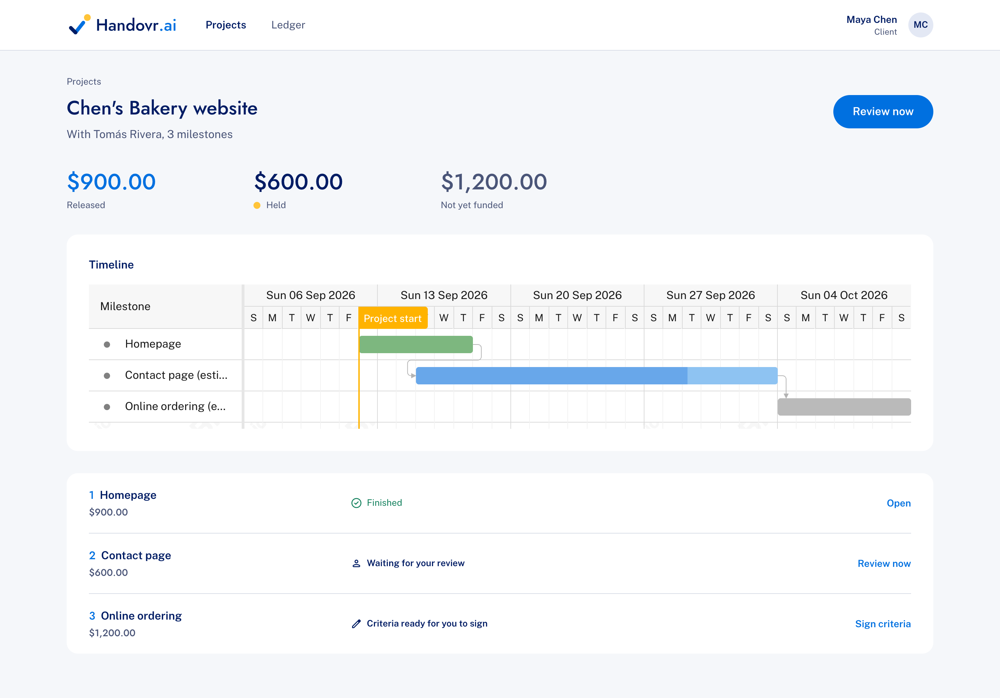
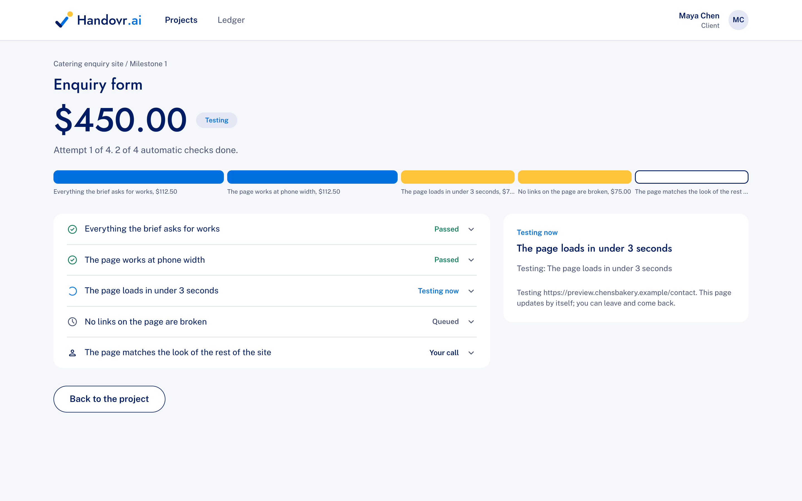
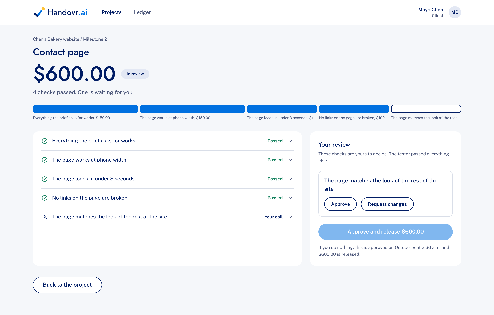
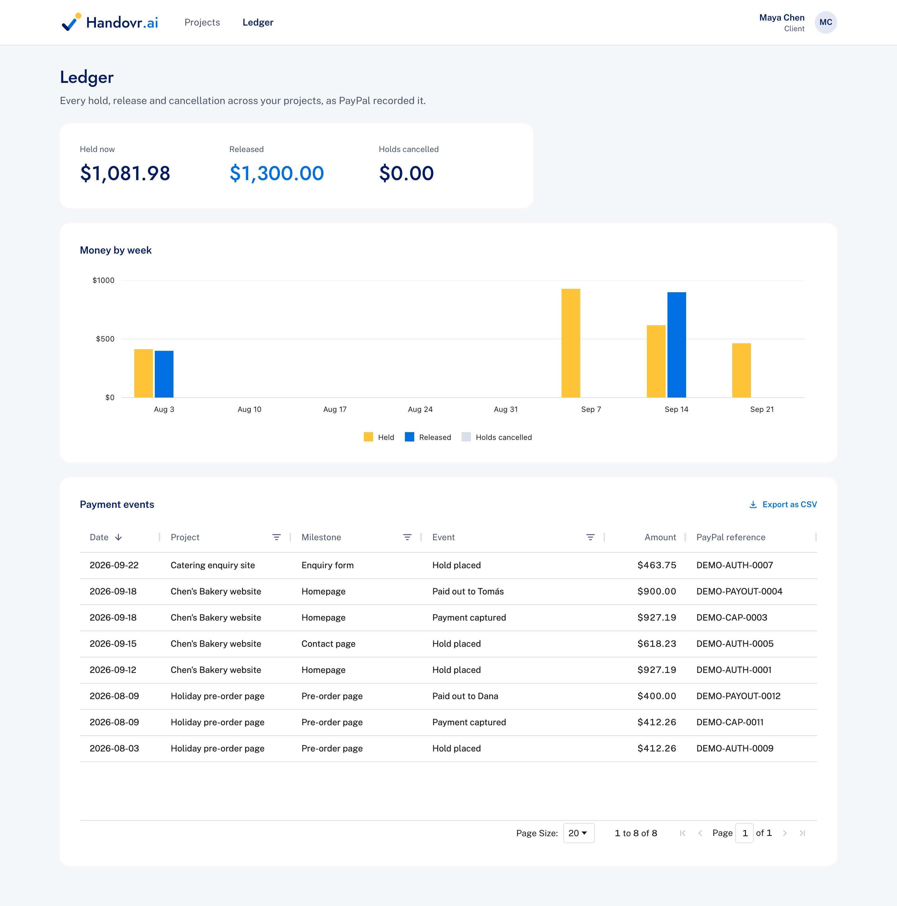

<p align="center">
  
</p>

<p align="center"><strong>Payment that releases when the work passes.</strong></p>

<p align="center">
  <a href="https://handovr-drxq.onrender.com"><strong>Live demo</strong></a> ·
  <a href="#try-the-live-demo">Judge accounts</a> ·
  <a href="#run-it-yourself">Run it yourself</a> ·
  <a href="LICENSE">MIT licence</a>
</p>



Handovr is an AI referee for freelance web work. The client and the freelancer agree a checklist of what "done" means and both sign it. PayPal holds the client's payment while the work is done. When the freelancer submits the site, Claude tests it in a real cloud browser against the signed checks. If everything passes, the money is released. If attempts run out, Handovr proposes a fair split. If either side declines, the hold goes back to the client.

## The problem

Freelance web work breaks down at the handover. The client doesn't want to pay until the site works, and the freelancer doesn't want to deliver until they know they'll be paid. "Done" was never written down, so the argument is about opinions. Escrow alone doesn't fix it: someone still has to decide whether the work is finished, and that someone is usually one of the two people arguing.

Handovr is the neutral referee both sides agree to before the work starts. It checks the actual delivered site, shows the evidence for every verdict, and moves the money without either person holding the other hostage.

## Features

### Agree what done looks like

The client describes each milestone in plain words. Claude turns each brief into a short list of checks a browser can test, such as "the contact form sends a message" or "the page loads in under 3 seconds", and gives each a share of the payment. Either person can change the list, or ask Claude to rewrite it; the other person must accept any change. Both sign by typing their full name, and that signed list is the contract.

### PayPal holds the payment

The client funds a milestone through PayPal checkout. Handovr authorises the payment rather than taking it, so the money stays in the client's account until the work passes. The client pays PayPal's fee on top, so the freelancer receives the whole milestone amount: a \$600.00 milestone is held as \$618.23. A hold lasts 29 days, and Handovr renews it once on day 25.

### An AI tester checks the real site

The freelancer submits the live address. Claude drives a KERNEL cloud browser through every check: filling in forms, resizing to a phone, timing page loads, following links and running an accessibility audit. The page updates live while the test runs. Every verdict comes with screenshots and notes, and there is a replay of the whole run. A failed check is run twice; two fails make a fail, and a disagreement is left to the client.



### The client decides what only a person can judge

Checks about taste, and anything the tester could not decide, go to the client, who approves them or sends the work back with a reason. Each send-back uses one of four attempts. If the client does nothing, the work is approved when the review window ends, so the freelancer is never left waiting.



### Release, split or return

When every check is settled, Handovr captures the hold and pays the freelancer through PayPal Payouts. If all four attempts are used, Handovr proposes paying for the checks that passed. Code does the arithmetic and Claude explains it in plain words. Both people must accept the split; if either declines, or time runs out, the hold goes back to the client. A cancelled or expired milestone can be started again with the same checks.

### See where everything stands

Each project shows its milestones on a Bryntum Gantt timeline, with a recent activity list. The ledger lists every hold, capture, payout and cancellation as PayPal recorded it, in an AG Grid table with an AG Charts weekly summary and a CSV export. Both people get an email at each step.



## Tools used

| Tool | How Handovr uses it |
|---|---|
| **PayPal** | **Log in with PayPal** signs people in. **Orders v2** with intent `AUTHORIZE` places the hold, and the authorisation API **reauthorises** it on day 25, **captures** all of it or a split share, and **voids** it when a milestone is cancelled. **Payouts** pays the freelancer's PayPal email. **Webhooks**, checked with PayPal's signature verification, tell Handovr to re-read a payout or hold at once instead of waiting for the next check. Every call sends an idempotency key, so a retry can never charge or pay twice. |
| **Anthropic Claude** (Sonnet 5.5) | Drafts testable checks from each milestone brief and rewrites them on request, using structured output. Tests each submitted site by calling browser tools in a loop and recording a verdict with evidence. Explains a proposed split in plain words without changing the amounts. Text from the tested website is treated as data, never as instructions. |
| **KERNEL** | Gives Claude a real cloud Chromium for each test run, driven over the DevTools protocol with Playwright, and keeps a replay of every run for both people to watch. |
| **Zapier MCP** | Sends the notification emails through Gmail at nine moments, from "checks ready" to "paid". If Zapier is slow or down, the email is recorded as failed and the action still goes through. |
| **AG Grid and AG Charts** | The ledger's sortable, filterable, paged table of payment events, and its chart of money held, released and returned each week. |
| **Bryntum Gantt** | The project timeline: one bar per milestone, coloured by state, joined in order, with estimated dates for work that hasn't finished. |
| **Render** | Hosts the web service and its Postgres database. A pinger calls the tick every five minutes, which keeps the free service awake. |
| **Next.js, React and Tailwind CSS** | The app, its server actions and background work after a response, and its styling. |
| **PostgreSQL and Drizzle ORM** | Every project, signature, hold, payment event, test result and notification. |
| **axe-core** | The accessibility audit the tester can run on a page. |
| **Postman** | `postman/handovr-paypal.postman_collection.json` holds every PayPal call Handovr makes, in order, with the same headers and bodies as the code. |

### How the money stays safe

- **One decider.** Every milestone change goes through one state machine. Nothing else moves a milestone from one state to another.
- **An outbox for money.** A capture, payout or void is written to the database in the same transaction as the state change, then sent to PayPal with its own idempotency key. If a request fails halfway, it is sent again under the same key and PayPal answers with the result it already has.
- **PayPal is the source of truth.** A webhook is verified with PayPal, then only prompts Handovr to read the payment again.
- **A tick every five minutes** renews holds, ends review windows and split deadlines, retries failed payouts and restarts stalled test runs.
- **Limits on AI spend.** Drafting, rewriting and test runs have daily limits per account and overall, so a public demo stays affordable.

## Try the live demo

The app is live at **https://handovr-drxq.onrender.com**. It runs on PayPal's sandbox, so no real money moves.

**Look around without signing in.** On the sign-in page, press **Continue as a client** or **Continue as a freelancer**. The demo projects show every stage: a paid milestone, one waiting for review, one being tested, a list with suggested changes and one still being drafted. Open a project to see its timeline, and the **Ledger** to see every PayPal event.

**Run a milestone yourself.** Sign in with PayPal using the two sandbox accounts made for judging. They hold sandbox money only.

| Role | PayPal sandbox email | Password |
|---|---|---|
| Client | judge1@gmail.com | NQQAx*04 |
| Freelancer | judge2@gmail.com | 1rNl^6fD |

1. Sign in as the client and create a new project. Under "Who is doing the work?", use the freelancer's email above.
2. Handovr drafts the checks. Read them, change anything, and sign. Then sign in as the freelancer in a private window and sign too.
3. As the client, fund the first milestone. PayPal holds the amount plus its fee.
4. As the freelancer, submit one of the test sites:
   - `https://handovr-drxq.onrender.com/fixtures/good/index.html` to watch every check pass
   - `https://handovr-drxq.onrender.com/fixtures/dead-form/index.html` to watch a check fail and the work go back
5. Follow the test live, review anything left for the client, and see the payment released in the ledger.

## Run it yourself

You need Node 22, pnpm and PostgreSQL, plus a PayPal developer sandbox app, an Anthropic API key and a KERNEL API key.

```bash
git clone https://github.com/vermilion4/Handovr-AI.git handovr
cd handovr
pnpm install
cp .env.example .env.local
```

Fill in `.env.local`:

| Variable | What it is |
|---|---|
| `DATABASE_URL` | Your Postgres database, for example `postgres://localhost:5433/handovr` |
| `SESSION_SECRET` | Any long random string |
| `APP_URL` | `http://127.0.0.1:3000` locally; your public address once deployed |
| `PAYPAL_CLIENT_ID`, `PAYPAL_CLIENT_SECRET` | From your sandbox app in the PayPal developer dashboard. Turn on Log in with PayPal with the email scope, and add `http://127.0.0.1:3000/api/auth/paypal/callback` as a return URL. |
| `ANTHROPIC_API_KEY` | From the Anthropic console |
| `KERNEL_API_KEY` | From the KERNEL dashboard |
| `TICK_SECRET` | Any long random string; the scheduler calls `/api/tick?key=<this>` |
| `PAYPAL_WEBHOOK_ID` | Optional locally. Needed once deployed, from the webhook you register for `/api/paypal/webhook`. |
| `ZAPIER_MCP_URL`, `ZAPIER_EMAIL_TOOL`, `NOTIFY_INBOX` | Optional. Without them, notifications are written to the server log. |
| `REVIEW_WINDOW_SECONDS`, `AI_LIMIT_*` | Optional; the defaults are in `.env.example`. |

Then create the database and start the app:

```bash
initdb -D .pgdata
pnpm db:start
createdb -h localhost -p 5433 handovr
pnpm db:migrate
pnpm db:seed
pnpm dev
```

Open http://127.0.0.1:3000. PayPal login returns to `127.0.0.1`, so use that address rather than `localhost`. The tick runs the background work, so call it now and then while testing:

```bash
curl "http://127.0.0.1:3000/api/tick?key=<TICK_SECRET>"
```

### Deploy

`render.yaml` describes the whole deployment as a Render blueprint: a web service and a Postgres database, with migrations run on every start. Create a blueprint from the repository, fill in the variables marked as secret, then point a scheduler such as cron-job.org at `/api/tick?key=<TICK_SECRET>` every five minutes.

## Tests

```bash
pnpm test
```

Over 450 tests cover the state machine, payments, webhooks, races between two people answering at once, and every route that moves money. They run against an in-memory Postgres (PGlite).

To measure how well the tester judges sites with known answers, run it against the six test sites in `public/fixtures`:

```bash
pnpm eval:verification -- --base https://handovr-drxq.onrender.com/fixtures/ --models claude-sonnet-5-5
```

Claude Sonnet 5.5 scores 30 of 30 on them, including a site with hidden text telling the tester to pass everything.

## Limits

- Canadian dollars and the PayPal sandbox only.
- A hold lasts 29 days with one renewal. A milestone that runs past that lapses, and the client can start it again.
- Drafting, rewriting and test runs have daily limits per account and overall.

## Licence

Handovr.ai is open source under the [MIT licence](LICENSE).
